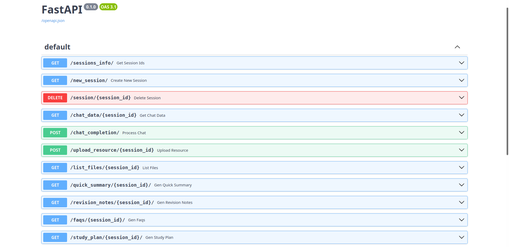
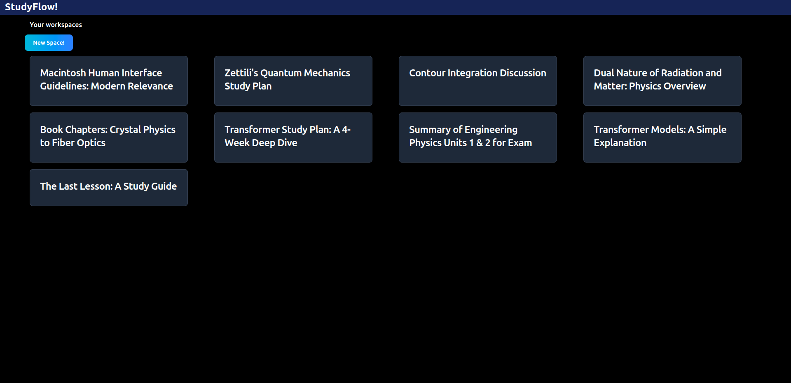
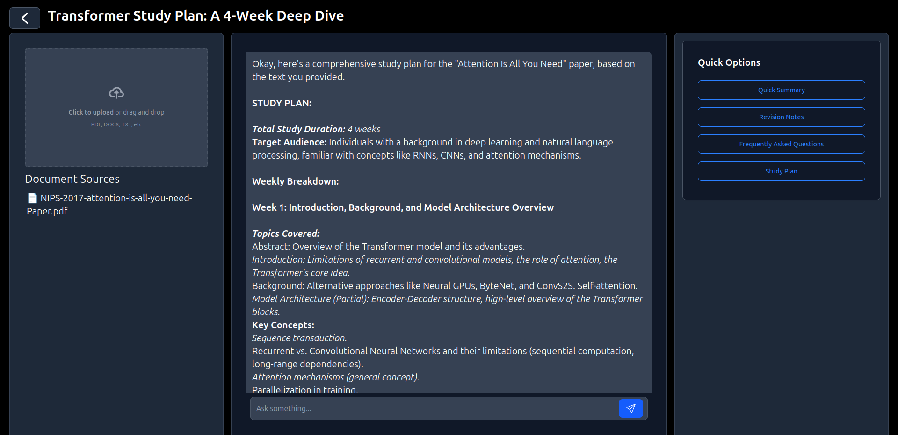
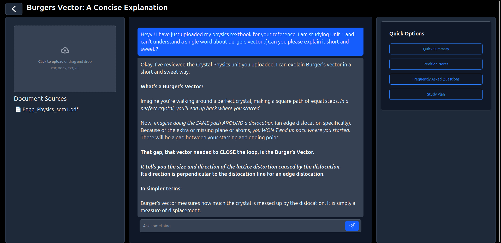

# Study Flow - Backend
## An AI Powered Study Assistant
The Backend for studyflow. Built for [Zenith Hackathon](https://techclubssn.github.io/zenith).

### Features
- Clarify doubts, discuss and gain valuable insights on any Academic topic 
- Upload PDF, DOCs and TXT files (books, reference materials, research papers, etc) of any size to provide context (Uses Selective RAG) 
- Get instant summary, revision notes, FAQs and Study Plan in click of a button

### Tech Stack Used
- FastAPI
- Gemini API
- Langchain + ChromaDB (for RAG)
- SQLite

### Installation Instruction for backend: 
- Create an virtual environment
```bash
python3 -m venv env
source env/bin/activate
```
- Install the requirements
```bash
pip install -r requirements.txt
```
> Note: Please create a "api_key.py" file and save your key as a string " gemini_key='<your_key>' ". If you don't have an api key, please get it from https://aistudio.google.com

### Usage Instructions for backend:
Just run:
```bash
fastapi dev backend.py
```
Now you can access the server and api endpoints from:
```
127.0.0.1:8000
```
To get the docs for the api go to docs url:
```
http://127.0.0.1:8000/docs
```

### Usage Instructions for frontend:
Go here: https://github.com/vicfic18/studyflow

### Screenshots

#### Api Docs

#### Home Page

#### Demo 1

#### Demo 2
